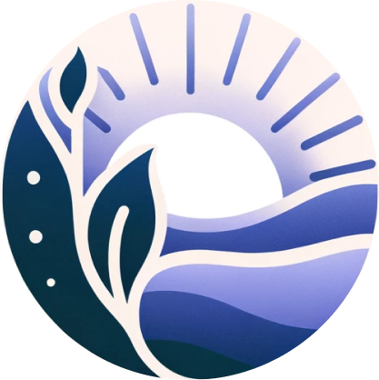
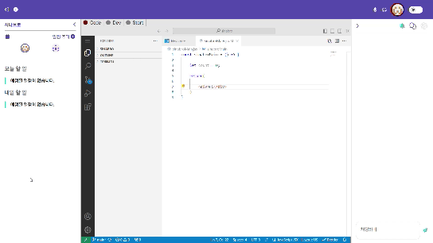

#  조금씩 천천히 시나브로 

초보 개발자를 위해 프로젝트 환경 제공 프로젝트 시나브로 입니다. 

시나브로와 함께해요

# 📣프로젝트 소개

내 프로젝트 코드가 잘 작성된 것인지 궁금할 때,
 
프로젝트를 함께 할 팀원을 구할 때,

시나브로와 함께해요

### 주요 사용자

- 웹 상에서 팀원들과 프로젝트를 진행하고 싶은 개린이
- 프로젝트를 함께할 팀원을 구하는 개린이
- 내가 작성한 코드가 좋은 코드인지 확인하고 싶은 개린이

### 주요 기능

- 프로젝트 진행 공간
  - VSCode 환경 제공
  - 코드 실행결과 화면 제공
  - 일정 관리, 팀원과 음성채팅, 일반 채팅, 챗봇
- 커뮤니티
  - 팀원구하기, 팀 구하기, 피드백 구하기에 따라 게시글 작성 가능
- 마이페이지
  - 사용자의 스택 작성
  - 프로젝트 리스트
  - 메모리 그래프 작성

 

# 📣기능 소개

#### 1. 메인화면
- 나의 팀스페이스 이동 화면
- 시나브로에서 생성된 프로젝트 확인 가능

#### 2. 팀 스페이스
- 프로젝트 설명, 팀원 정보, 일정 확인 가능
- 결제 시 소나큐브를 이용한 정적 코드 분석 정보 제공

- VSCode환경 및 실행 환경 제공
- 음성 채팅, 일반채팅 챗봇 기능 제공
- 일정 관리 기능 제공

#### 5. 마이페이지
- 사용자의 기술스택 표현
- 프로젝트 리스트 확인
- 메모리 그래프를 이용한 정보 정리

#### 4. 커뮤니티
- 팀원 구해요, 팀 구해요, 피드백 원해요 카테고리 분류
- 팀원 구해요 : 프로젝트 링크를 통해 팀원을 구하는 프로젝트 확인 가능
- 팀 구해요 : 개인 프로필 링크를 통해 글쓴이의 스택 확인 가능
- 피드백 원해요: 프로젝트 링크를 통해 코드 확인 후 피드백 제공 가능

 

# 📣기술 스택

 

# 🐣개발 환경

### **Back-end**
  - Java Version : Zulu JDK 17.44.15
  - SpringBoot Version: 3.2.4
      - spring.dependency-management version: 1.1.4
  - JJWT: 0.12.3
  - openvidu: 2.29.0
  - Neo4j: 2023.9.4
  - Mysql-Server: 8.0.36

### **Front-end**
  - nodejs Version: 20.10.0
  - bootstrap Version: 5.3.2
  - reduxjs/toolkit: 2.1.0
  - firebase: 10.10.0
  - openai : 4.33.0
  - openvidu-browser : 2.29.1
  - socket.io : 4.7.4
  - socket.io-client

### **CI/CD**
  - AWS EC2
  - Jenkins
  - Docker

 

# 👪개발 멤버

|NAME|ROLE|
|------|---|
|🐹김윤민|Back
|🐫박종국|Back
|🐳송승준|Back
|⭐️박주헌|Front
|🐥전은희|Front & Team Leader
|🐯최재성|Front
