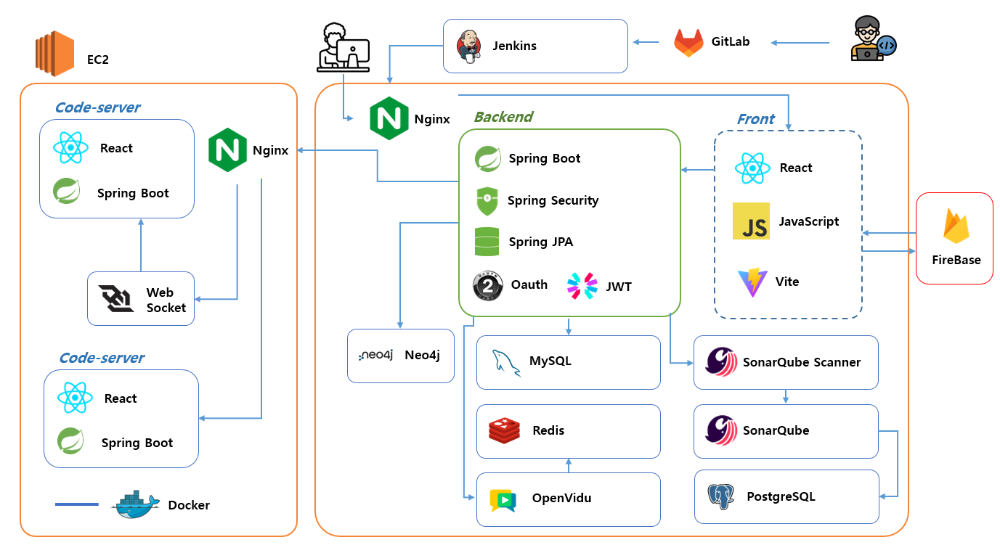

#  조금씩 천천히 시나브로 

🏆 해당 프로젝트는 SSAFY 10기 자율 프로젝트 우수상을 수상한 프로젝트입니다 ! 🏆

초보 개발자를 위해 프로젝트 환경 제공 프로젝트 시나브로 입니다. 

시나브로와 함께해요 😄

# 목차
1. [📣프로젝트 소개](#📣프로젝트-소개)
2. [📣기능 소개](#📣기능-소개)
3. [🛠 기술 특이점](#🛠-기술-특이점)
4. [아키텍처 설계도](#아키텍처-설계도)
5. [ERD](#erd)
6. [기술 스택](#📣기술-스택)
7. [🐣개발 환경](#🐣개발-환경)
8. [👪개발 멤버](#👪개발-멤버)

# 📣 프로젝트 소개

내 프로젝트 코드가 잘 작성된 것인지 궁금할 때,
 
프로젝트를 함께 할 팀원을 구할 때,

시나브로와 함께해요

### 주요 사용자

- 웹 상에서 팀원들과 프로젝트를 진행하고 싶은 개린이
- 프로젝트를 함께할 팀원을 구하는 개린이
- 내가 작성한 코드가 좋은 코드인지 확인하고 싶은 개린이

### 주요 기능

- 프로젝트 진행 공간
  - VSCode 환경 제공
  - 코드 실행결과 화면 제공
  - 일정 관리, 팀원과 음성채팅, 일반 채팅, 챗봇
- 커뮤니티
  - 팀원구하기, 팀 구하기, 피드백 구하기에 따라 게시글 작성 가능
- 마이페이지
  - 사용자의 스택 작성
  - 프로젝트 리스트
  - 메모리 그래프 작성

 

# 📣기능 소개

#### 1. 메인화면
- 나의 팀스페이스 이동 화면
- 시나브로에서 생성된 프로젝트 확인 가능
- 모든 화면에서 다크모드 제공

#### 2. 팀 스페이스
- 프로젝트 설명, 팀원 정보, 일정 확인 가능
- 결제 시 소나큐브를 이용한 정적 코드 분석 정보 제공

#### 3. 코드 서버
- 격리된 VSCode환경 및 실행 환경 제공
- 브라우저 창을 새로 켤 필요 없이 기존의 화면을 분할해서 볼 수 있는 실행 화면 제공
- 음성 채팅, 일반채팅 챗봇 기능 제공
- 일정 관리 기능 제공

#### 4. 마이페이지
- 사용자의 기술스택 표현
- 프로젝트 리스트 확인
- 메모리 그래프를 이용한 정보 정리

#### 5. 커뮤니티
- 팀원 구해요, 팀 구해요, 피드백 원해요 카테고리 분류
- 팀원 구해요 : 프로젝트 링크를 통해 팀원을 구하는 프로젝트 확인 가능
- 팀 구해요 : 개인 프로필 링크를 통해 글쓴이의 스택 확인 가능
- 피드백 원해요: 프로젝트 링크를 통해 코드 확인 후 피드백 제공 가능

#### 6. 피드백페이지
- 타인의 소스 코드 열람 기능 제공
- 소스 코드 열람자는 열람 이외의 동작 제어
- 채팅을 통해 피드백 신청자에게 피드백 제공 가능

 

# 🛠 기술 특이점

- **깃허브 로그인**
  - OAuth 2.0 을 이용해 깃허브 유저의 정보를 불러와서 로그인에 활용
  - 로그인한 유저의 인증 정보를 Spring Security 를 통해서 관리
  - 깃허브 유저 정보를 jwt 로 변환해서 사용
  - Security Filter 를 전역적으로 등록해 유연한 유효성 검증
- **SonarQube**
  - JSch를 통한 정적분석 Flow 자동화
    - 환경설정 자동화
    - 깃 Repo Master브랜치 기준 폴더 선택해서 자동화 가능
    - 생성한 SonarQube결과와 연동해 Issue 원격 관리 
- **Portone**
  - Portone을 통한 결제 시스템을 통해 정적분석 가능
  - 결제 유효 검증을 위해서 서버를 2번 거쳐서 결제 진행
- **Openvidu**
  - 서버에서 세션 관리
  - 팀 프로젝트 당 하나의 채팅방 제공을 위해 서버에서 세션코드 및 커넥션 토큰 제공
- **neo4j 를 활용한 메모리 그래프 시각화**
  - NoSql의 일종인 Graph DB 의 대표적인 neo4j를 사용
  - Query 와 비슷한 Cypher 라는 명령어를 사용
  - 노드와 노드간의 연결을 표현할 수 있는 관계를 지정가능
  - 직관적인 데이터 모델링을 통해 사용자에게 뛰어난 시각화 효과를 제공
- **Code-server**
  - Docker의 네트워크 격리 특성을 이용하여 개별 사용자에게 독립된 환경 제공
  - 포트 포워딩 및 리버스 프록시를 통해 개개인에게 하나의 주소와 해당 포트를 제공
  - JSch 라이브러리를 활용하여서 백엔드 서버에서 EC2 서버에 SSH 연결 및 내부에서 명령어 실행
  - Nginx 프록시 서버와 코드 서버 사이에 웹 소켓 서버를 두어서 사용자의 행동을 중간에서 제어
 

# 아키텍처 설계도 

# ERD

# 📣기술 스택

 

# 🐣개발 환경

### **Back-end**
  - Java Version : Zulu JDK 17.44.15
  - SpringBoot Version: 3.2.4
      - spring.dependency-management version: 1.1.4
  - JJWT: 0.12.3
  - openvidu: 2.29.0
  - Neo4j: 2023.9.4
  - Mysql-Server: 8.0.36

### **Front-end**
  - nodejs Version: 20.10.0
  - bootstrap Version: 5.3.2
  - reduxjs/toolkit: 2.1.0
  - firebase: 10.10.0
  - openai : 4.33.0
  - openvidu-browser : 2.29.1
  - socket.io : 4.7.4
  - socket.io-client

### **CI/CD**
  - AWS EC2
  - Jenkins
  - Docker

 

# 👪개발 멤버

|NAME|ROLE|
|------|---|
|🐹김윤민|Back
|🐫박종국|Back
|🐳송승준|Back
|⭐️박주헌|Front
|🐥전은희|Front & Team Leader
|🐯최재성|Front

